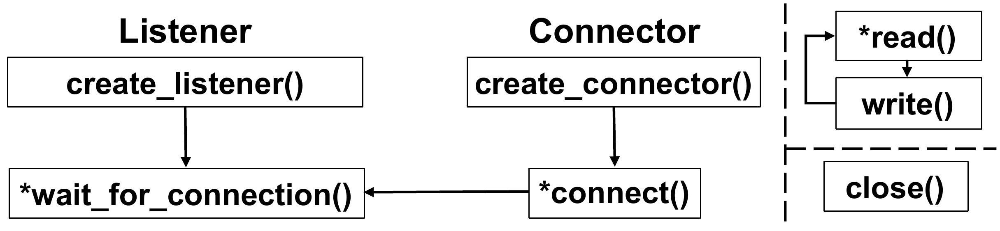
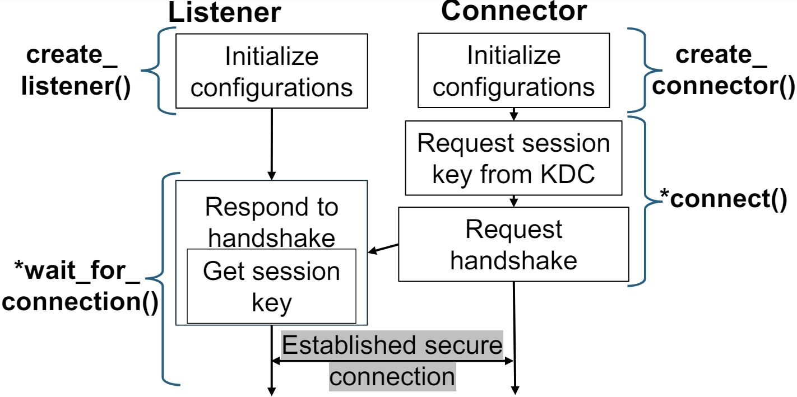
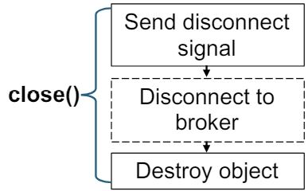
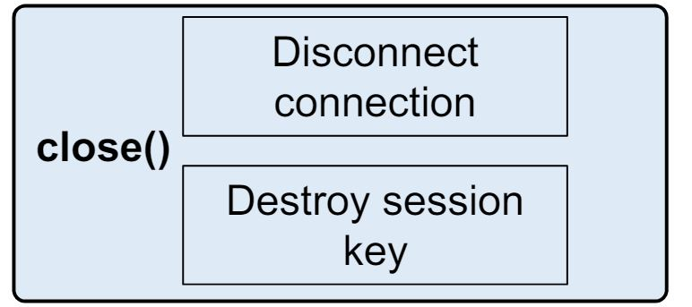
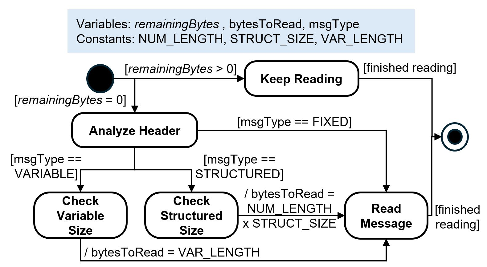

- Start Date: 2024-06-20
- RFC PR: [lf-lang/rfcs#0000](https://github.com/lf-lang/reactor-c/pull/330)
- Tracking Issue(s): [lf-lang/lingua-franca#0000](https://github.com/lf-lang/lingua-franca/issues/0000)

# Abstract
[abstract]: #abstract

This RFC adds network interoperability, which includes network security, and applying other network stacks.
It provides a network interface layer to the federated execution in `reactor-c`, for easily adding other network stacks.

NOTE: We do not propose to change the Lingua Franca protocol or any message formats. 
It should be discussed in another RFC.

Work-in-progress PRs (not ready for review yet): https://github.com/lf-lang/lingua-franca/pull/2256 https://github.com/lf-lang/reactor-c/pull/330

# Motivation
[motivation]: #motivation
We propose to create a layer of abstraction for the network-related code, making it a network interface which enables the easy addition of other network stacks, including adding end-to-end configurable security.

The current code base is entangled with TCP sockets, making it difficult to add different network stacks.
adding encryption to the current code is very difficult when we are trying to minimize changing the original code.

For example, when trying to add security, the `reactor-c` code base did not consider network security when it was implemented in the first place, making it very difficult when trying to minimize changing the original code structure.
We explain further details and rationale in the [Send](#Send) section.

Thus, we aim to support different types of underlying network communication protocols and encryption including TCP (same as the current socket), Pub-Sub (e.g., MQTT), and End-to-End Security such as SSL/TLS or [Secure Swarm Toolkit (SST)](https://github.com/iotauth).

### Motivation on applying Security in Federated Execution.

The original implementation of federated execution was not 'secure' in two points.
1. The current messages sent over the network are all fully plaintext, which does not ensure the confidentiality of the message.
2. The federates joining the federation are not authenticated. Any malicious federate can join the federation, if they know the `federation_id`.

# Proposed Implementation
[proposed-implementation]: #proposed-implementation

## New features
The communication type is selected as a target property.

```
target C {
  comm-type: TCP // TCP is default when not defined.
}
```
## Overview
### Network Interface
The proposed API consists of roughly three phases and 7 API functions described below.

1.  **Establishing a Communication Session.** 

  - We can say a `connector` is requesting a connection to a `listener`. 
    In the most simple case, the `federate` will be the connector, and the `RTI` will be the listener. 
    Also, for decentralized coordination, one federate listening to inbound connections will be the `listener`, and the other federate connecting outbound will be the `connector`.  
  - The goal is to create a session between the `listener` and the `connector`.
  -  The `listner` will first create a `netdrv_t`, and call `establish_communication_session()`, which will listen to incoming connection requests.
    The `connector` will create a `netdrv_t` for connection, and call `connect_to_netdrv()`.
  - This includes `create_connector()`, `create_listener()`, `establish_communication_session()` and `connect_to_netdrv()`.

  Note: `establish_communication_session()` function is described as `wait_for_connection()`.

2. **Close**

  - This sends disconnection signals, and frees the memory.
  - This includes `close_netdrv()`.

3. **Sending and Receiving**

  - This sends messages, and receives messages.
  - This includes `write_to_netdrv()` and `read_from_netdrv()`.


Details will be explained further below.



### `netdrv_t`

The main feature of this design uses a struct named `netdrv_t` which stands for 'network driver'. 

```C
typedef struct netdrv_t {
  void* priv;
  ...
} netdrv_t;
```
The **`void* priv`** is cast to another struct depending on the communication stack used.
For example,
```C
typedef struct socket_priv_t {
  int socket_descriptor;
  uint16_t port;
  uint16_t user_specified_port;
  ...
} socket_priv_t;
```


## Code Structure

The network layer code is under this directory `core/src/main/resources/lib/c/reactor-c/core/federated/network`
```
.
├── CMakeLists.txt
├── lf_mqtt_support.c
├── lf_socket_support.c
├── lf_sst_support.c
├── netdriver.c
├── net_util.c
└── socket_common.c
```
The compilation does not compile unused files. For example, when using TCP, it does not require `lf_mqtt_support.c` and `lf_sst_support.c`.
However, due to clock synchronization after initial clock-sync requires UDP, **all types require `socket_common.c`**. 


## Details of Implementation
[Details of Implementation]: #details
## 1. Establishing Communication Sessions
This part is where the `connector` actually connects to the `listener`.

### TCP
For TCP, it would look like this.


- `create_listener()` : Creates server socket, binds and listens.
- `wait_for_connection()` : Calls accept(), and blocks.
- `create_connector()` : Create socket.
- `connect_to_netdrv()` : Requests connect().

### MQTT
For MQTT, we use the [Paho MQTT API](https://github.com/eclipse/paho.mqtt.c), for implementation.

When establishing communication for MQTT, it would require a protocol to join.


The point is to make a single channel for each connection, to ensure messages are not mixed up.

For one connection between an RTI and a federate, there will be three topics.
1. Topic name `federationID_rti`: This is for federates joining messages. This topic is used for every federate requesting to join. The federate sends their `federate_id` to this topic, to inform the RTI that there is a connection request.
2. Topic name `federationID_rti_to_fedID`: This is a channel for only the RTI sending messages to the federate.
2. Topic name `federationID_fedID_to_rti`: This is a channel for only the federate sending messages to the RTI.

To establish the connection and ensure it, there will be a three-way handshake which is similar to the TCP-ACK messages.

### SST (Secure Swarm Toolkit)

SST is an open-source toolkit framework designed to offer robust authorization and authentication mechanisms for distributed environments.
The local entity Auth provides authentication and authorization for its locally registered entities.
So using the SST-C-API provides end-to-end security.
The users do not have to get bothered by key management and cryptography.

SST is based on TCP, so it shares some parts of the code with the TCP implementation.



The network interface implementation uses the SST-C-API and includes key distribution and authentication of the federates.

## 2. Close (`close_netdrv()`)

This `close_netdrv()` disconnects the connection, and frees the memory allocated from the `netdrv`.

### TCP
TCP's `close_netdrv()` will `shutdown()` and `close()` the socket, and free memory of the `netdrv`.

### MQTT

In TCP, the `shutdown()` sends a FIN packet to the connected socket, and `read()` can catch it, and it will return 0. In `read_from_netdrv()`, we return 0, indicating the other side's `netdrv` was disconnected.

Unlike TCP, MQTT does not have this feature. So when `close_netdrv()` is called, it must send an `MQTT_RESIGNED` message to the other side to inform that it has been closed.

After this, it should disconnect with the broker, and free all memory related to MQTT, and the `netdrv`.




### SST

This is based on TCP, so it will `shutdown()` and `close()` the socket, destroy the session key, and free the memory of the `netdrv`.



## 3. Send (`write_to_netdrv()`) and Receive (`read_from_netdrv()`)
 <a id="Send"></a>

This part is the core of this RFC and needs the discussion most.
I will first describe how the original code works, and why it is very challenging to apply encryption in the original structure.

### How the original code works
The current implementation uses TCP, which is a byte stream, meaning data is transmitted as a continuous stream of bytes without explicit message boundaries.
So, LF is transferring messages (signals) in 'messages' with message headers, however, the implementation does not, due to it being a byte stream and this is not a problem.
So sending a single message can be done by calling the `write()` multiple times, and also `read()` can be multiple times for receiving a single message.

### Terms
Before starting the explanation, we need exact terms.
The `write()` is the POSIX `write()` function, and same with `read()`
```C
#include <unistd.h>
// write() writes up to count bytes from the buffer starting at buf
ssize_t write(int fd, const void buf[.count], size_t count);

//read() attempts to read up to count bytes into the buffer starting at buf.
ssize_t read(int fd, void buf[.count], size_t count);
```

The `write_to_socket()` and `read_from_socket()` are defined in `net_util.c`.

The difference between these operations, is that the POSIX functions 'attempt' and read and write 'up to' the count. 
These functions return the actual count the read or wrote.
However, the LF `write_to_socket()` and `read_from_socket()` functions, **repeat the read and write until the actual count reaches the required count**.
Keep this in mind.

### Continuing...
The problem starts by calling the `write_to_socket()` multiple times, and also calling `read_from_socket()` multiple times for receiving a single message.

For example, `MSG_TYPE_FED_IDS` consists of like this:

|`MSG_TYPE_FED_IDS` (1 byte) | `federate_ID` (2 bytes) | `federationID_length` (1 byte) | `federation_ID` (n) |

In this message, the federation_ID is variable. 
So, it sends the first 4 bytes of the buffer, and then sends the variable lengthed federation ID.
The original code does this.
```C
# federate.c
// make buffer = |MSG_TYPE_FED_IDS|federate_ID|federationID_length| 
write_to_socket(buffer); // send first 4 bytes.
write_to_socket(federation_ID); // send the federation_id.
```
```C
# rti_remote.c
// Read the 4 byte header.
read_from_socket(buffer, 4);
// extract length of federation_id
federation_id_length = buffer + 3;
char federation_id_received[federation_id_length + 1];
read_from_socket(federation_id_received, 4);
```
So for a sending a single 'message', there can be these four cases.

Case 1: One write(), One read()

Case 2: One write(), Multiple read()

Case 3: Multiple write(), One read()

Case 4: Multiple write(), Multiple read()

Only case 1, 2, and 4 exists in the LF code base. 
Most messages on initialization step is done with case 1. 
After connection, most messages are done with case 2, since, it first reads the one byte message header, and then goes through a `switch case` and reads the payload.

### Why Encryption Does Not Work

The original implementation looks efficient, minimizing `memcpy()`s, because it does not make a complete message buffer and send it.
However encryption does not work on this structure.

<details>
<summary><b>Short Background on AES Encryption</b></summary>

AES is a commonly used symmetric block cipher, which encrypts data in a fixed-size block (16 bytes).
So for example, if we want to encrypt bytes from [1,16], the cipher text will always be 16 bytes.
Decryption also is done in blocks of 16 bytes.
Partial decryption of a single block is not possible in block ciphers.
</details>


To apply encryption, before sending a message, we want to encrypt and send it, and when we receive a message, we want to receive and decrypt it.
So, the logic would look like this.
```C
write_to_socket(char* buffer, int buffer_length) {
  encrypt(buffer, buffer_length, encrypted, encrypted_length); // Encrypt the buffer into the 'encrypted' buffer.
  write(encrypted, encrypted_length);
}

read_from_socket(char* decrypted, int decrypted_length) {
  received_length = read(received); // Receive the encrypted buffer in 'received' buffer.
  decrypt(received, received_length, decrypted, decrypted_length); // Decrypt the buffer to the 'decrypted' buffer.
}
```

So, Case 1 looks straightforward. 
We encrypt a total message and send it, and decrypt a total message and return the decrypted message.

Let's have a look on Case 2.
For example, MSG_TYPE_TIMESTAMP is sent and received as case 2, and the message looks like this.

| MSG_TYPE_TIMESTAMP(1 byte) | timestamp (8 bytes) |

When it is sent, it is sent in once. 
When it is received, it is received twice.

```C
# federate.c
// make buffer = | MSG_TYPE_TIMESTAMP(1 byte) | timestamp (8 bytes) |
write_to_socket(buffer, 9); // send 9 bytes.
-->encrypt(buffer, 9, encrypted, 16); // Returns a encrypted buffer of 16 bytes.
-->write(encrypted, 16); // Send encrypted buffer.
```
```C
# rti_remote.c
// Read message header.
read_from_socket(buffer, 1);
-->read(encrypted, 16); // Must read total block to decrypt. Partial block decryption is impossible.
-->decrypt(encrypted, 16, buffer, buffer_length); // Must decrypt the total block, which returns the total buffer length 9.

// Read timestamp.
read_from_socket(buffer + 1, 8);
   //Everyting is already decrypted. What do we do here?
-->read(encrypted, encrypted_length);
-->decrypt(encrypted, encrypted_length, buffer, buffer_length); 
```

The first `write_to_socket()` will encrypt the complete message of 9 bytes.
So, there will be a 16 byte ciphertext of the message.
Now, the first `read_from_socket(buffer, 1);` should return the one byte header of the message.
As the ground rules, of `read_from_socket()` we need to first `read()` the TCP stream, and then `decrypt()` the message. 
However, partial block decryption is not available in AES due to the nature of block ciphers, so it must needs to read the total block to decrypt.
This decryption returns the complete message, not only the message type.
So, on the second `read_from_socket()` call, there is no message to `read()`, which will block the code.

There are solutions for keeping the original code, it will be discussed on the [Alternative1](#alternatives) section, however it is very complex, and inefficient.

So this can be fixed if we can match the number of `write_to_socket()` and `read_from_socket()` calls.
**I propose the `write_to_netdrv()` and `read_from_netdrv()` to be message oriented, sending a complete message each time.**

### Why Other Application Layer Network Protocols Does Not Work
This is similar as the reason why encryption does not work.
Application layer network protocol's task is to send the requested data, and receive it itself.
It does not look into the payload itself.

<details>
<summary><b>For more details.</b></summary>

Let's use the same example, `MSG_TYPE_TIMESTAMP`, and send it via some protocol.

```C
# federate.c
// make buffer = | MSG_TYPE_TIMESTAMP(1 byte) | timestamp (8 bytes) |
write_to_socket(buffer, 9); // send 9 bytes.
-->wrap_up_data(buffer, 9, wrapped, wrapped_length); // Returns a wrapped buffer.
-->send_via_protocol(wrapped, wrapped_length); // Send wrapped buffer.
```
```C
# rti_remote.c
// Read message header.
read_from_socket(buffer, 1);
-->receive_via_protocol(wrapped); // Read the total wrapped up message.
-->decapsulate_data(wrapped, buffer, buffer_length); // Must decrypt the total block, which returns the total buffer length 9.

// Read timestamp.
read_from_socket(buffer + 1, 8);
   //Everyting is already received. What do we do here?
-->receive_via_protocol(wrapped);
-->decapsulate_data(wrapped, buffer, buffer_length); 
```
</details>


### Sending and Receiving Complete Messages

Changing the `write_to_netdrv()` and `read_from_netdrv()` call to send and receive complete messages enables encryption, and is scalable for other network stacks.
The input variable is same as before, however the `buffer` will require the complete message when sending, and will return the complete message when receiving.

```C
int write_to_netdrv(netdrv_t* drv, unsigned char* buffer, size_t buffer_length);
ssize_t read_from_netdrv(netdrv_t* drv, unsigned char* buffer, size_t buffer_length);
```


However, there are some engineering problems, and drawbacks to address.

#### write_to_netdrv()
<a id="memcpy-drawbacks"></a>
The design of the `write_to_netdrv()` requires the total message to be sent in one call. 
As a result, there must be a `memcpy()` which makes the data to a single buffer.
However, most message types are already doing `memcpy()`, however the data is small from 1~8 bytes.
Only additional `memcpy()`s are required on six message types: `MSG_TYPE_FED_IDS`(+P2P version), `MSG_TYPE_NEIGHBOR_STRUCTURE`, `MSG_TYPE_TAGGED_MESSAGE`(+P2P version) , `MSG_TYPE_P2P_MESSAGE`.

For better understanding, the same example used as above, `MSG_TYPE_FED_IDS` consists of like this:

|`MSG_TYPE_FED_IDS` (1 byte) | `federate_ID` (2 bytes) | `federationID_length` (1 byte) | `federation_ID` (n) |

The original code does this.
```
// make buffer = |MSG_TYPE_FED_IDS|federate_ID|federationID_length| 
write_to_socket(buffer);
write_to_socket(federation_ID);
```

The new code does this.
```
// make buffer = |MSG_TYPE_FED_IDS|federate_ID|federationID_length| 
memcpy(buffer + 4, federation_ID, length);
write_to_netdrv(buffer);
```

The `memcpy()` is inevitable, due to the design of `write_to_netdrv()`, which requires the complete message.
The overhead is trivial in most cases.
For `MSG_TYPE_FED_IDS`, the length of the federation_id is bound to 255 bytes.
For `MSG_TYPE_NEIGHBOR_STRUCTURE` the number of federates are small in most cases.
However, it does matter when `MSG_TYPE_TAGGED_MESSAGE` is sending very large data. 
The total tagged_message data has to be copied to the buffer to send.
(Note that the maximum size of the TAGGED_MESSAGE is approx. 4GB, due to the length is maximum 4 bytes of unsigned int.)


#### read_from_netdrv()

The `read_from_netdrv()` returns the complete LF message.
The internal logic will call `read()` multiple times, until it receives the entire buffer.
This is possible, because the message length is defined as the message type itself, for example, `MSG_TYPE_TIMESTAMP` has always a 1 byte header, and 8 byte timestamp.
So, in most cases with fixed length messages, `read()` will be called twice.


For variable length messages, including `MSG_TYPE_FED_IDS` and `MSG_TYPE_NEIGHBOR_STRUCTURE`, the `read_from_netdrv()` will first, `read()` the message type, then `read()` the required payload length, and then `read()` the varaible payload.

The most challenging part is `MSG_TYPE_TAGGED_MESSAGE` which can send large size messages.
In centralized coordination, the RTI does not save the completely received buffer, but sends the received fragment to the target federate immediately.
However, the `read_from_netdrv()` is designed to receive the complete message.
To address this problem, the `netdrv_t` has a member `int read_remaining_bytes` which indicates that there are more bytes to read.
So, when the `read_from_netdrv()` is first called, it will check the `read_remaining_bytes`, and if it exists, it does not do the message type check and `read()`s as much as it can.

However, there is some complexity in this code, and this happens because the code was only considering TCP.
It can be addressed, by maybe changing the protocol and sending scheme when large files are sent.
This should be discussed in another RFC.

The whole process is described in this simplified state machine.



The initial state first checks the remainingBytes. 
-  If there are no remainingBytes, it reads the first bytes, and enters 'Analyze Header' state.
    - Depending on the 'msgType', if the msgType requires FIXED bytes, it enters 'Read Message' state, and reads the payload and exits.
    - If the 'msgType' requires VARIABLE bytes, it reads the header, and sets the 'bytesToRead' to VAR_LENGTH.
      Then, it finally reads the 'bytesToRead' and exits.
    - Structured length is also similar, indicating the `MSG_TYPE_NEIGHBOR_STRUCTURE`.
- If there are 'remainingBytes', it does not read the first byte. Instead enters the Keep Reading state. This is only used for `MSG_TYPE_TAGGED_MESSAGE`.
    - It is not described in the state machine, but it reads as many bytes as it can, up to the provided buffer's length.
    - It updates the 'remainingBytes' and exits.
    - This is needed when TAGGED MESSAGEs are very long. 
      The RTI does not save the entire message, but just relays it to the other federate.
    


### TCP

The total change of TCP is proposed above.

### MQTT

MQTT does not require a complicated state machine.
MQTT is an application layer protocol, which includes the payload length inside its own header.
So, if the sender sends a complete message, the receiver will receive the entire message.

Sending a message from a federate to the RTI, actually involves a broker. The message will be sent from the federate to the broker, then the broker will send it to the RTI. To ensure message order QOS 2 is required.

However, MQTT does not support sending large files currently, and the protocol is not intended to send large files.
Also, brokers have a defined message size limit, which does not support very large sizes.
I am not planning to support large sized tagged_messages.


### SST

SST also does not require the state machine also, because it has its own protocol including the payload length.
The SST's `write` will encrypt the total message with the key, and ensure message integrity using HMAC. Then it will send the concatenated ciphertext and HMAC.

The SST's `read` will first check the received message integrity, and then decrypt the message and return the plaintext.

Different keys are used for different communication sessions.
For example, when `federate_1` sends a message to `federate_2` via the `RTI`, each sessions use different keys. 
The session between `RTI` and `federate_1` will use `key1`, and between `RTI` and `federate_2` will use `key2`.
So, when `federate_1` is sending a tagged message via the `RTI` to `federate_2`, `federate_1` encrypts the message and sends it to the `RTI`, the `RTI` decrypts the message using `key1`, and encrypts the message using `key2`, and sends it to `federate_2`.


# Drawbacks
[drawbacks]: #drawbacks

Drawbacks on TCP should be mostly considered, which will be mostly used.

### 1. `memcpy()` overhead ###

Details in [above](#memcpy-drawbacks).


### 2. `MSG_TYPE_NEIGHBOR_STRUCTURE` overhead (minor) 
When using TCP, `MSG_TYPE_NEIGHBOR_STRUCTURE` introduces small overhead of reading the number of upstream and downstreams. 
For most messages, excluding `MSG_TYPE_FED_IDS`, `MSG_TYPE_NEIGHBOR_STRUCTURE` and `MSG_TYPE_TAGGED_MESSAGE` (also with `P2P` versions), the message size is determined, and we can know the exact bytes to read. 
However, the types above have dynamic message sizes, so it cannot be handled by one single `read()`.

The two types, `MSG_TYPE_FED_IDS` and `MSG_TYPE_TAGGED_MESSAGE` has a byte that indicates the length of the dynamic part of the message. 
However, the `MSG_TYPE_NEIGHBOR_STRUCTURE` does not have this 'length indicator' byte, and it must be extracted by the bytes indicating the number of upstreams, and number of downstreams.

So, this extraction will first be on the `read_from_netdrv()` stage, and will happen again, when it is actually trying to use the data.
This happens because there is no way to pass this data out the `read_from_netdrv()` function.

However, this is a very trivial overhead that happens only on the initialization phase, and can be easily fixed by adding a byte indicating the length of the rest of the message such as the other two message types.

# Rationale and alternatives


The main purpose of the RFC is to abstract the underlying layer, separating from the Lingua Franca application layer protocol.
I expect more scalability and maintainability in the code.

## Alternatives
### Alternative 1: Keeping the Code: Using Single `write_to_netdrv()` and Multiple `read_from_netdrv()`?
<a id="alternative1"></a>

Possible Solution1: We can use stream ciphers (AES-CTR) instead of block ciphers (AES-CBC, AES-GCM). 
This is straightforward, however, AES-CTR is not the standard due to it's security vulnerabilities such as replay attacks.

Possible Solution2: We can make some logic to check if there is any already decrypted bytes.
But then, we need somewhere to save the decrypted bytes, since the decrypted buffer will be in stack memory, and point that when we need it again.
But this already requires more memory, and the code gets very complex.

### Alternative 2: Using Multiple `write_to_netdrv()` and Multiple `read_from_netdrv()`?
<a id="alternative2"></a>

Possible Solution: What about just matching the number of `write_to_netdrv()` and `read_from_netdrv()`?
This removes the drawback of memcpy(), especially effectively when sending large files.
However, the code complexity increases, requiring logic to handle segmentation and reassembly of messages, in LF level.
Also, this leads to more opportunities for error handling due to the segmentation and reassembly process.

Efficiency problems also happen when using other protocols, and applying security.
More computation is required when sending a single message.
For example, when we split a message and send it, encryption has to be done twice, for each splitted part.

# Unresolved questions
[unresolved-questions]: #unresolved-questions

```
> **Clock Synchronization**: Is it right for runtime clock-sync after initial clock-sync to be always done in UDP?
> **CI Testing**: How should we test the target property comm-type?
> **MQTT latency**: How should we handle the latency on MQTT?
> **Use case of MQTT**: Are there any practical use cases for MQTT?
```

## Further Concerns
### MQTT Overheads ###
The latency when using MQTT is very poor. I evaluated the average `lag`, defined as `physical_time - logical_time`, in distributed environments using two RPI4s and one workstation, connected within the same Wi-Fi network. I sent a `TAGGED_MESSAGE` and the average lag for TCP and SST was around 14~15 ms, however, MQTT showed 188 milliseconds. This is due to some reasons.

1. QOS 2 : This is for ensuring the message is sent in order, which is critical for LF. However, this brings a large overhead. When sending a single message from a federate to the RTI, **16 TCP** messages are sent behind the scenes. (Note: 4 messages between federate and broker, 4 messages between broker and RTI. Another 8 for the RTI and other federate.)

2. Centralized Coordination: As explained above, all messages are through the broker, which makes twice the number of TCP messages. Haven't tested the exact time of Decentralized coordination.

The problem is that this latency makes STP violation, which does not allow passing most tests.

### Code Quality
Substantial code has been changed on the RTI code, federate code, and TCP-related code, and also code has been added due to MQTT, and SST.
It is hard to test if I handled all corner cases that has been figured out before.

# Future possibilities
[future-possibilities]: #future-possibilities

This is a place to collect further ideas that are beyond the scope of the RFC
topic. This is an optional section and may be left blank. It can be used to
collect ideas that pop up during the review process.
