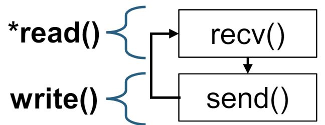

- Start Date: 2024-06-20
- RFC PR: [lf-lang/rfcs#0000](https://github.com/lf-lang/reactor-c/pull/330)
- Tracking Issue(s): [lf-lang/lingua-franca#0000](https://github.com/lf-lang/lingua-franca/issues/0000)

# Abstract
[abstract]: #abstract

This RFC adds network interoperability, which includes network security, and applying other network stacks.
It provides a network interface layer to the federated execution in `reactor-c`, for easily adding other network stacks.

# Motivation
[motivation]: #motivation

The original implementation was not 'safe' in two points.
1. The current messages sent over the network are all fully plaintext, which does not ensure the confidentiality of the message.
2. The federates joining the federation are not authenticated. Any malicious federate can join the federation, if they know the `federation_id`.

When trying to add security, the main challenge is that the `reactor-c` code base did not consider network security when it was implemented in the first place. The code base is entangled with TCP sockets, thus making it difficult to add an additional layer of end-to-end security. We explain further details and rationale in the [Send] section.

We propose to create a layer of abstraction for the network-related code, making it a network interface which enables the easy addition of other network stacks.

We aim to support different types of underlying network communication protocols and encryption including TCP (same as the current socket), Pub-Sub (e.g., MQTT), and End-to-End Security such as SSL/TLS or [Secure Swarm Toolkit (SST)](https://github.com/iotauth).

# Proposed Implementation
[proposed-implementation]: #proposed-implementation

## Overview
### Network Interface
The proposed API consists of roughly three phases and 6 API functions described below.

1.  **Establishing a Communication Session.** 

  - We can say a `connector` is requesting a connection to a `listener`. 
    In the most simple case, the `federate` will be the connector, and the `RTI` will be the listener. 
    Also, for decentralized coordination, one federate listening to inbound connections will be the `listener`, and the other federate connecting outbound will be the `connector`.  
  - This includes `create_connector()`, `create_listener()`, `establish_communication_session()` and `connect_to_netdrv()`.

2. **Close**

  - This sends disconnection signals, and frees the memory.
  - This includes `close_netdrv()`.

3. **Sending and Receiving**

  - This sends messages, and receives messages.
  - This includes `write_to_netdrv()` and `read_from_netdrv()`.


Details will be explained further below [Details of Implementation].


### `netdrv_t`

The main feature of this design uses a struct named `netdrv_t` which stands for 'network driver'. 

```C
typedef struct netdrv_t {
  void* priv;
  ...
} netdrv_t;
```
The **`void* priv`** is cast to another struct depending on the communication stack used.

The communication type is selected as a target property.

```
target C {
  comm-type: TCP // TCP is default when not defined.
}
```

## Code Structure

The code is under this directory `core/src/main/resources/lib/c/reactor-c/core/federated/network`
```
.
├── CMakeLists.txt
├── lf_mqtt_support.c
├── lf_socket_support.c
├── lf_sst_support.c
├── netdriver.c
├── net_util.c
└── socket_common.c
```
The compilation does not compile unused files. For example, when using TCP, it does not require `lf_mqtt_support.c` and `lf_sst_support.c`.
However, due to clock synchronization after initial clock-sync requires UDP, all types require `socket_common.c`. 


## Details of Implementation
[Details of Implementation]: #details
## 1. Establishing Communication Sessions
This part is where the `connector` actually connects to the `listener`.

### TCP
For TCP, it would look like this.


- `create_listener()` : Creates server socket, binds and listens.
- `wait_for_connection()` : Calls accept(), and blocks.
- `create_connector()` : Create socket.
- `connect_to_netdrv()` : Requests connect().

### MQTT
For MQTT, we use the [Paho MQTT API](https://github.com/eclipse/paho.mqtt.c), for implementation.

When establishing communication for MQTT, it would require a protocol to join.


The point is to make a single channel for each connection, to ensure messages are not mixed up.

For one connection between an RTI and a federate, there will be three topics.
1. Topic name `federationID_rti`: This is for federates joining messages. This topic is used for every federate requesting to join. The federate sends their `federate_id` to this topic, to inform the RTI that there is a connection request.
2. Topic name `federationID_rti_to_fedID`: This is a channel for only the RTI sending messages to the federate.
2. Topic name `federationID_fedID_to_rti`: This is a channel for only the federate sending messages to the RTI.

To establish the connection and ensure it, there will be a three-way handshake which is similar to the TCP-ACK messages.

### SST (Secure Swarm Toolkit)

SST is an open-source toolkit framework designed to offer robust authorization and authentication mechanisms for distributed environments.
The local entity Auth provides authentication and authorization for its locally registered entities.
So using the SST-C-API provides end-to-end security.
The users do not have to get bothered by key management and cryptography.

SST is based on TCP, so it shares some parts of the code with the TCP implementation.


The network interface implementation uses the SST-C-API and includes key distribution and authentication of the federates.

## 2. Close (`close_netdrv()`)

This `close_netdrv()` disconnects the connection, and frees the memory allocated from the `netdrv`.

### TCP
TCP's `close_netdrv()` will `shutdown()` and `close()` the socket, and free memory of the `netdrv`.

### MQTT

In TCP, the `shutdown()` sends a FIN packet to the connected socket, and `read()` can catch it, and it will return 0. In `read_from_netdrv()`, we return 0, indicating the other side's `netdrv` was disconnected.

Unlike TCP, MQTT does not have this feature. So when `close_netdrv()` is called, it must send an `MQTT_RESIGNED` message to the other side to inform that it has been closed.

After this, it should disconnect with the broker, and free all memory related to MQTT, and the `netdrv`.


### SST

This is based on TCP, so it will `shutdown()` and `close()` the socket, destroy the session key, and free the memory of the `netdrv`.


## 3. Send (`write_to_netdrv()`) and Receive (`read_from_netdrv()`)
[Send]: #Send

This part is the core of this RFC and needs the discussion most.
I will first describe how the original code works, and why it is very challenging to apply encryption in this structure.

## How the original code works
The current implementation uses TCP, which is a byte stream, meaning data is transmitted as a continuous stream of bytes without explicit message boundaries.
So, LF is transferring messages (signals) in 'messages' with message headers, however, the implementation does not, due to it being a byte stream and this is not a problem.
So sending a single message can be done by calling the `write()` multiple times, and also `read()` can be multiple times for receiving a single message.

### Terms
Before starting the explanation, we need exact terms.
The `write()` is the POSIX `write()` function, and same with `read()`
```C
#include <unistd.h>
// write() writes up to count bytes from the buffer starting at buf
ssize_t write(int fd, const void buf[.count], size_t count);

//read() attempts to read up to count bytes into the buffer starting at buf.
ssize_t read(int fd, void buf[.count], size_t count);
```

The `write_to_socket()` and `read_from_socket()` are defined in `net_util.c`.

The difference between these operations, is that the POSIX functions 'attempt' and read and write 'up to' the count. 
These functions return the actual count the read or wrote.
However, the LF `write_to_socket()` and `read_from_socket()` functions, **repeat the read and write until the actual count reaches the required count**.
Keep this in mind.

### Continuing...
The problem starts by calling the `write_to_socket()` multiple times, and also `read_from_socket()` can be multiple times for receiving a single message.

For example, `MSG_TYPE_FED_IDS` consists of like this:

|`MSG_TYPE_FED_IDS` (1 byte) | `federate_ID` (2 bytes) | `federationID_length` (1 byte) | `federation_ID` (n) |

In this message, the federation_ID is variable. So, it sends the first 4 bytes of the buffer, and then sends the variable lengthed federation ID.
The original code does this.
```C
# federate.c
// make buffer = |MSG_TYPE_FED_IDS|federate_ID|federationID_length| 
write_to_socket(buffer); // send first 4 bytes.
write_to_socket(federation_ID); // send the federation_id.
```
```C
# rti_remote.c
// Read the 4 byte header.
read_from_socket(buffer, 4);
// extract length of federation_id
federation_id_length = buffer + 3;
char federation_id_received[federation_id_length + 1];
read_from_socket(federation_id_received, 4);
```
So for a sending a single 'message', there can be these four cases.

Case 1: One write(), One read()

Case 2: One write(), Multiple read()

Case 3: Multiple write(), One read()

Case 4: Multiple write(), Multiple read()

Only case 1, 2, and 4 exists in the LF code base. Most messages on initialization step is done with case 1. After connection, most messages are done with case 2, since, it first reads the one byte message header, and then goes through a `switch case` and reads the payload.

### Why Encryption Does not Work

The original implementation looks efficient, minimizing `memcpy()`s. However encryption does not work.

What we want to do, is before sending a message, we want to encrypt it, and when we receive a message, we want to decrypt it.
AES is a common symmetric encryption scheme which is a block cipher.
So, the logic would look like this.
```C
write_to_socket(buffer, buffer_length) {
  encrypt(buffer);
  write(buffer);
}

read_from_socket(received, buffer_length) {
  read(received);
  decrypt(received);
}
```

So, Case 1 looks straightforward. We encrypt a total message and send it, and decrypt a total message and return it.

Let's have a look on Case 2.
For example, MSG_TYPE_TIMESTAMP is a message which looks like this.

| MSG_TYPE_TIMESTAMP(1 byte) | timestamp (8 bytes) |

When it is sent, it is sent in once. When it is received, it is received twice.

```C
# federate.c
// make buffer = | MSG_TYPE_TIMESTAMP(1 byte) | timestamp (8 bytes) |
write_to_socket(buffer); // send 9 bytes.
```
```C
# rti_remote.c
// read message header.
read_from_socket(buffer, 1);
// read timestamp.
read_from_socket(buffer + 1, 8);
```
The first `write_to_socket()` will encrypt the total message.
So, there will be a ciphertext of the total message.
Now, the first `read_from_socket(buffer, 1);` should return the one byte header of the message.
However, this is not possible in encryption.
It is not able to partially decrypt this message only returning the message header.

So, to address this problem, **we need to match the number of `write_to_socket()` and `read_from_socket()` calls**.

### TCP

I propose the `write_to_netdrv()` and `read_from_netdrv()` to be message oriented.




### MQTT

Sending a message from a federate to the RTI, actually involves a broker. The message will be sent from the federate to the broker, then the broker will send it to the RTI. To ensure message order QOS 2 is required.


### SST

The SST's `write` will encrypt the total message with the key, and ensure message integrity using HMAC. Then it will send the concatenated ciphertext and HMAC.

The SST's `read` will first check the received message integrity, and then decrypt the message and return the plaintext.


# Drawbacks
[drawbacks]: #drawbacks

Drawbacks on TCP should be mostly considered, which will be mostly used.

### 1. `memcpy()` overhead ###
The design of the `write_to_netdrv()` requires the total message to be sent in one call. As a result, there must be a `memcpy()` which make the data to a single buffer.

For example, `MSG_TYPE_FED_IDS` consists of like this:

|`MSG_TYPE_FED_IDS` (1 byte) | `federate_ID` (2 bytes) | `federationID_length` (1 byte) | `federation_ID` (n) |

The original code does this.
```
// make buffer = |MSG_TYPE_FED_IDS|federate_ID|federationID_length| 
write_to_socket(buffer);
write_to_socket(federation_ID);
```

The new code does this.
```
// make buffer = |MSG_TYPE_FED_IDS|federate_ID|federationID_length| 
memcpy(buffer + 4, federation_ID, length);
write_to_netdrv(buffer);
```

The `memcpy()` is inevitable, due to the design of `write_to_netdrv()`, which requires the total message.

However, this creates a high overhead when sending `MSG_TYPE_TAGGED_MESSAGE` with very large data. (Note that the maximum size of the TAGGED_MESSAGE is approx. 4GB, due to the length is maximum 4 bytes of unsigned int.)

### 2. `MSG_TYPE_NEIGHBOR_STRUCTURE` overhead ###
When using TCP, `MSG_TYPE_NEIGHBOR_STRUCTURE` introduces small overhead of reading the number of upstream and downstreams. For most messages, excluding `MSG_TYPE_FED_IDS`, `MSG_TYPE_NEIGHBOR_STRUCTURE` and `MSG_TYPE_TAGGED_MESSAGE` (also with `P2P` versions), the message size is determined, and we can know the exact bytes to read. However, the types above have dynamic message sizes, so it cannot be handled by one single `read()`.

The two types, `MSG_TYPE_FED_IDS` and `MSG_TYPE_TAGGED_MESSAGE` has a byte that indicates the length of the dynamic part of the message. However, the `MSG_TYPE_NEIGHBOR_STRUCTURE` does not have this 'length indicator' byte, and it must be extracted by the bytes indicating the number of upstreams, and number of downstreams.

However, this is a very trivial overhead that happens only on the initialization phase, and can be easily fixed by adding a byte indicating the length of the rest of the message such as the other two message types.

### 3. MQTT Overheads ###
The latency when using MQTT is very poor. I evaluated the average `lag`, defined as `physical_time - logical_time`, in distributed environments using two RPI4s and one workstation, connected within the same Wi-Fi network. I sent a `TAGGED_MESSAGE` and the average lag for TCP and SST was around 14~15 ms, however, MQTT showed 188 milliseconds. This is due to some reasons.

1. QOS 2 : This is for ensuring the message is sent in order, which is critical for LF. However, this brings a large overhead. When sending a single message from a federate to the RTI, **16 TCP** messages are sent behind the scenes. (Note: 4 messages between federate and broker, 4 messages between broker and RTI. Another 8 for the RTI and other federate.)

2. Centralized Coordination: As explained above, all messages are through the broker, which makes twice the number of TCP messages. Haven't tested the exact time of Decentralized coordination.

The problem is that this latency makes STP violation, which does not allow passing most tests.

### 4. Code Quality
Substantial code has been changed on the RTI code, federate code, and TCP-related code, and also massive code has been added due to MQTT, and SST.

# Rationale and alternatives
[rationale-and-alternatives]: #rationale-and-alternatives

- Which alternative designs where considered?
- Is there prior art and what can we learn from it?
- Why is the proposed design the best design?

# Unresolved questions
[unresolved-questions]: #unresolved-questions

```
> **Clock Synchronization**: Is it right for runtime clock-sync after initail clock-sync to be always done in UDP?
> **CI Testing**: How should we test the target property comm-type?
> **MQTT latency**: How should we handle the latency on MQTT?
> **Use case of MQTT**: Are there any practical use cases for MQTT?
```

# Future possibilities
[future-possibilities]: #future-possibilities

This is a place to collect further ideas that are beyond the scope of the RFC
topic. This is an optional section and may be left blank. It can be used to
collect ideas that pop up during the review process.
