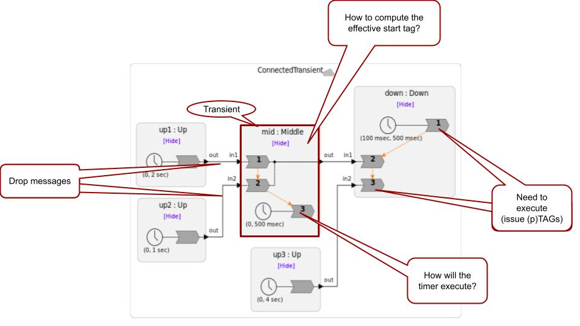
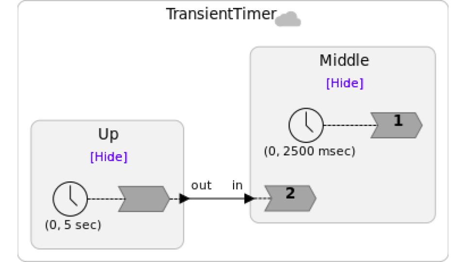
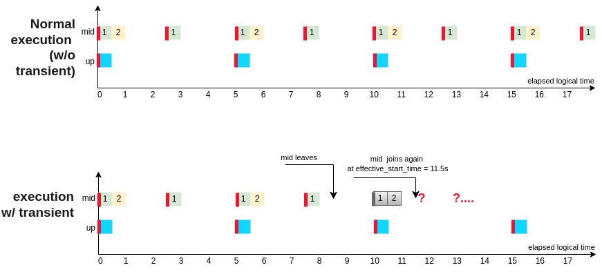
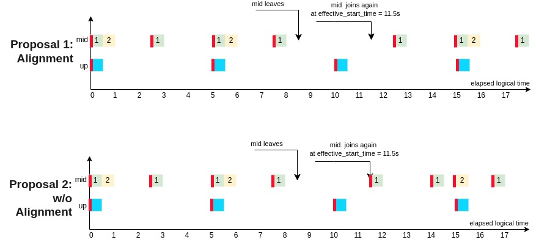

- Feature Name: `transient-federates`
- Start Date: 2024-03-02
- RFC PR: [lf-lang/rfcs#5](https://github.com/lf-lang/rfcs/pull/5)
- Tracking Issue(s): [Discussion 2212](https://github.com/lf-lang/lingua-franca/discussions/2212)

# Abstract
[abstract]: #abstract

Right now, a federation runs as a single monolithic application, albeit split across machines.  When the federation starts, all federates that will ever join have to join right at the start.  The federation will not start otherwise.
And the assumption is that if any federate leaves the federation, the whole federation should shut down.  There are applications for which that design makes sense, but there are many applications that need more flexibility. This RFC, co-authored with @ChadliaJerad, proposes to introduce the concept of a **transient federate**, a federate that is optionally present or absent.  A federation can start executing without transient federates being present, and transient federates can come and go during execution.
This RFC addresses only how this can be supported with centralized coordination.

# Motivation
[motivation]: #motivation

Distributed computing fundamentally differs from ordinary programs in a number of ways.
First, the communication between components is via networks, which have potentially ubounded delay and can fail on individual links.
Second, the components themselves can fail independently.
Third, for some applications, the number of components involved in a distributed computation can vary over time.

Visualize, as a canonical example, a distributed bulletin board application, where individual components maintain a history of conversation, there is a requirement for consistency across these components (all users that see common messages see them in the same order), and components can come and go at will (this application is described in detail [here](https://arxiv.org/abs/2109.07771)).
First, there is no requirement that all participants be present for the service to start.
Nevertheless, as participants come and go, the service has to ensure that any two participants that see any two posts see them in the same order (see [here](https://arxiv.org/abs/2109.07771) for anomalies that can result otherwise).

The bulletin board application is by no means general.
It has a special feature that (potentially) all components see all posts made by other components.
Another application that shares such a structure is a distributed database.
There are many more applications, however, where the communication topology is less homogeneous.
Any distributed LF program, for example, could be a candidate if it tolerates components failures. Imagine a network of reactors in a federated program where the failure of a single federate needs to not cause the entire federation to fail.
Such a federate becomes absent and then, possibly, becomes present again after a reboot or a repair.

A major goal of the RFC is to provide a basic underlying mechanism that can lead to such fault tolerance.
It is not a goal of this RFC to provide the mechanisms for detecting failures nor for tolerating extended absences. Arguably, these mechanisms already exist in LF, and, in any case, these mechanisms will be application specific.

The major challenge addressed in this RFC is to ensure that when a (transient) federate joins a federation that is already running, that all federates that interact with this transient federate agree on the tag at which the joining happens.
This is a basic prerequisite for ensuring the kind of consistency indicated in the bulletin board example, where all participants see posts in the same order.


# Goals and Non-Goals
[Goals and Non-Goals]: #goals-and-non-goals

### Goals

The scope of this work is to solve one key problem:  How does a federate join a federation that is already running?  Solving this requires solving the following subproblems:

1. Enabling a federation to start without all federates having connected. Which ones are required for starting and which ones are not?  The answer to this question is application specific, and hence we need to provide syntax for a programmer to distinguish between transient federates and non-transient federates.
2. What does it mean for a federate to "absent"?
3. How do we ensure that when a federate joins, all federates affected by it agree on the tag at which that happened?
4. How should timers in a joining transient federate align with timers in other federates?  Should they start at the time of joining (as in modal models with reset transitions), or should they start as if they had been running since the federation started?
5. How can a federate leave a federation in an orderly fashion without ending the whole federation, and what is the tag at which that happens?

In prototyping transient federates, we realized that they enable a simple "hot swap" mechanism as a small embellishment that follows almost immediately from having solved the problems above.
This mechanism is identical to having a federate join late, with the exception that it replaces an existing federate rather than filling an empty slot.
However, this possibility raises some concerns, explained below.
The "hot swap" mechanism, therefore, is considered a secondary (and perhaps optional) goal.

### Non-Goals

1. The LF language definition includes the notion of a "mutation," which is runtime change in the structure of the program. These are currently only experimentally supported in the TypeScript target. Transient federates are not indended to replace mutations. There is no change in structure implied by a transient federate. Instead, a transient federate can be viewed as a static component with two modes, present and absent. When it is absent, it ignores inputs and produces no outputs. When it is present, it reacts to inputs and possibly produces outputs. The goal of this RFC, therefore, is to define the transitions between these modes.

2. How to ensure that a federate that joins after startup is somehow "valid"?  This problem is no different from how we ensure that a federate that joins at startup is valid.  We have an authentication mechanism, thanks to @hokeun's team, which solves a key part of the problem, but it is only part of the problem.  A more complete solution is needed both at startup and when any transient federate joins.

3. A limited form of "hot swapping" can be realized as a small extension of transient federates.  All that is required is for a transient federate to join even when there is already a running federate in its slot.  The mechanism would be to simply orchestrate an orderly shutdown of the running federate followed by a joining of the replacement. However, this does not come close to providing a true hot-swap mechanism. How does a "hot swapped" component inherit state from the component it is replacing?  This is an important question, but any solution to this problem will be pretty orthogonal to this RFC and could be part of much bigger effort to improve fault tolerance. This RFC could facilitate some experimentation in this direction, where the transfer of state can be left up to the application designer. They just have to store and restore the state of their reactors.

4. How to build an LF application that may, for part of its lifetime, participate in a federation, and for other parts of its lifetime, operate autonomously.  This would be a very interesting extension, but it is out of scope for this RFC.


# Proposed Implementation
[proposed-implementation]: #proposed-implementation

## Program Definition

A federation with transient federates is very similar to an existing federation with the only change being that some federates are marked **transient**.  We propose to do that with an annotation on the instantiation, like this:

```lf
    @transient
    foo = new Foo()
```

This annotation will allow the federation to start without instance `foo` of reactor class `Foo`.
That is, when the RTI has heard from all non-transient federates, it will determine the starting tag and notify all federates that have joined to begin execution at that tag.

## Startup of the Federation

To support this, we propose that the RTI's command-line interface acquire one more option, `-nt` or `--number_of_transient_federates`.  Currently, the RTI takes a command-line argument `-n` or `--number_of_federates` that specifies the total number of federates that it should expect to join the federation.  The `-nt` option will simply specify how many of those are transient.  For example,

```sh
    $ RTI -n 6 -nt 3
```

specifies a total of six federates, three of which are transient.
When a federate joins a federation, it sends a signal of type `MSG_TYPE_FED_IDS` to the RTI.  This signal will need to augmented with at least one bit that identifies whether the federate is transient or persistent.
When the RTI has seen all the persistent federates join, it starts the federation as before.

The `lfc` code generator generates launch scripts for conveniently launching a federation. 
We propose that these scripts launch only the non-transient federates and leave the transient federates to be launched by hand.

## Joining the Federation

When a transient federate _F_ wishes to join a federation that is running, it should join using the same protocol as for non-transient federates, which begins with a `MSG_TYPE_FED_IDS` signal to the RTI (which carries the federation ID) and may include HMAC authentication.
The RTI will reject _F_ if the federation ID does not match, if authentication fails, or if a federate with same ID as that of _F_ is already in the federation.
Otherwise, _F_ will synchronize its clock with that of the RTI (if this is enabled) and wait for further instructions from the RTI.

The RTI will need to choose an **effective start tag** _g_ at which _F_ will join.
It will have to ensure that no downstream federate has advanced to _g_ or greater.
Downstream federates cannot advance to a particular tag until the RTI sends them a TAG (tag advance grant) or PTAG (provisional tag advance grant) signal, so the RTI can choose the maximum of all (P)TAG signals sent to downstream federates and add one microstep to determine an effective start tag for _F_.

Moreover, the RTI will have to ensure that no upstream federate has sent a message with tag _g_ or greater in order to grant _F_ the effective start tag _g_.
With centralized coordination, all messages flow through the RTI, so the RTI can choose the maximum tag of messages from upstream federates and add one microstep.
The effective start tag _g_ will have to be at least this big.

A transient federate will need a way to access the effective start tag as well as the global start tag.
We propose that in the C target, `lf_time_start()` report the global starting time (the microstep is always zero) for consistency across a federation.
We can add to the API a function `lf_tag_start_effective()` that will return the effective start tag.

One issue is that the RTI currently will send (P)TAG signals to downstream federates with no concern for physical time.  A downstream federate may have sent a NET (or NMR) signal with a tag _g'_ that is far in the future compared to physical time, and, if it is safe, the RTI may immediately grant advancement to _g'_.  If there has been such a grant far in the future, then _F_ will be granted an effective start tag that is also far in the future.
This will delay _F_ joining the federation.

Our proposal is that for any federate that has an absent upstream transient federate, the RTI delay the granting of any (P)TAG with tag _g'_ until physical time at the RTI has surpassed _g'_.
This will minimize the delay of _F_ joining the federation at the expense of a modest increase in lag experienced by downstream federates.
We believe this increase in lag is an unavoidable consequence of the CAL theorem.

Hence, the RTI maintains a queue of (P)TAG signals to be sent when physical time advances sufficiently.
If and when a federate joins, any pending (P)TAG signals waiting to be sent will need to be cancelled and reconsidered when a NET signal is received from the joining transient.

## Knowing About Upstream Transient Federates

The above proposal requires that the RTI know for each federate that is present whether it has an upstream transient federate that is absent.
The connection topology becomes known to the RTI as federates join because, during startup, each federate sends a `MSG_TYPE_NEIGHBOR_STRUCTURE` signal to the RTI that lists upstream and downstream federate IDs.
Any federate that lists an upstream ID that is not present is downstream of an absent transient federate, as is every federate downstream of it.
These facts will need to be recomputed each time a transient federate joins.
They do not need to be recomputed when a transient federate leaves, however, although it might be a nice optimization to go ahead and recompute them whenever a transient performs an orderly departure (i.e., not a departure by failure).

## Testing

To test transient federates in CI, we propose that test programs include reactions that launch transient federates.
The timing of such launches can be controlled in the usual way for LF programs.
Currently, since we do not control physical time in CI, it will be tricky to devise tests that cannot flake, but it is not hard to see how to make flaky failures unlikely.
In the future, if we control physical time in CI, these tests could be made non-flaky by construction.

In addition, tests should include federations where federates simulate failure by exiting prematurely, and where other federates detect the failure and replace the missing federate with a new instance of a transient federate.

To support testing, the following convenience functions are needed:

- `lf_stop()`: Causes the federate to stop its execution and perform an orderly shutdown, informing the RTI of its stop tag.  This function can also be useful for end-user applications to perform an orderly shutdown, and therefore should be part of the public API.  Unlike `lf_request_stop()`, this process does not require necessitate any consensus. A disorderly shutdown can be tested by having a federate that just exits with no interaction with the RTI.
- `lf_tag_start_effective()`: Returns the effective start tag of the federate. This can be part of the public API and can return the global start tag for non-transient federates.
- `lf_get_federates_bin_directory()`: Returns the directory containing the executables of the individual federates. This will be needed to write test programs that start transients after the federation has started.  This need not be part of the public API.
- `lf_get_federation_id()`: returns the federation id. This function is useful for creating federates at runtime when testing.  This need not be part of the public API.

## Example

In the following example, instance `mid` is a transient federate:



While `mid` is absent, `down` needs to be able to react to its internal timer and to `up3`.
It will send NET(_g'_) signals to the RTI.
The RTI will treat `down` as if only `up3` is upstream of it for the purpose of determining whether it can grant a TAG (it will not grant a PTAG because this example has no zero-delay cycles).
Based on the most recent NET from `up3`, if the RTI determines that it can grant a TAG(_g'_), then it will check its physical clock time.
If the physical time is greater than or equal to _g'_, it will send the TAG(_g'_).
Otherwise, it will queue the TAG(_g'_) to be sent when the RTI's physical clock advances to _g'_.
If `mid` is still absent at that time, then the RTI will send TAG(_g'_) to `down`, allowing it to advance its time.

When `mid` initiates the process of joining, the RTI will add one microstep to the greatest _g'_ it has sent in a TAG signal to `down`.
It will also check for the largest tag it has seen on messages from `up1` and `up2` and add one microstep to that.
It will then choose the larger of these two tags and inform `mid` that its effective start tag is this larger tag.
It will cancel any pending TAGs queued for `down`.

## Zero-Delay Cycles

The RTI needs to know the connection topology of the federation in order to identify federates that are in a zero-delay cycle (ZDC).
Those federates are sent PTAG signals instead of TAG in certain circumstances.
The RTI learns about the connection topology because, during startup, each federate
sends a `MSG_TYPE_NEIGHBOR_STRUCTURE` signal that lists the IDs of federates upstream and downstream from it together with the minimum **after** delays on connections to those federates.

If the federation has a ZDC that is broken by one or more transient federates, then the RTI will not know about the ZDC until all such transient federates have joined.
Hence, the RTI will need to re-run the ZDC detection algorithm each time a transient federate joins.
In the meantime, while the ZDC is broken by one or more absent federates, the RTI will treat federates in the ZDC as if they are not in the ZDC.

When a transient federate leaves the federation, assuming this occurs at a well-defined tag, the RTI will again have to re-run the ZDC cycle detection algorithm.
It would be incorrect to continue to treat the federates in the cycle as if they are in a ZDC because, when a federate receives is PTAG, it may block indefinitely waiting for a `MSG_TYPE_PORT_ABSENT` signal from an upstream federate.
If that federate itself is absent, it cannot send the signal.

Note that this mechanism can only work if a transient leaves a federation at a well-defined tag.
If a transient fails, then this may not occur.
The RTI should be able to detect such failures, but there is a cost.
In the current implementation, such failures can be detected by attempting to signal a federate.
If the federate has failed, the socket connection will report a broken-socket error.
However, such failures can go unnoticed for a long time if the RTI makes no attempt to send a signal to the federate.

One possible solution is that when the RTI sends a PTAG to a federate that is downstream of a present transient federate, it actively watches for `MSG_TYPE_PORT_ABSENT` messages (or normal messages) from the transient, and periodically pings the transient until it sees such messages.
The periodicity of the pings will put an upper bound on the time it takes to detect a failure.

A simpler solution, and perhaps the best choice in the near term, is to disallow transient federates in ZDCs.  This can be enforced by the validator. 

## Timers in Transient Federates

A key question is how to start timers in a transient federate when it joins.
Consider the following simple example:

```lf
federated reactor {
  up = new Up()
  @transient
  mid = new Middle()
  up.out -> mid.in
}
```



Suppose that the `Middle` reactor starts with the rest of the federation, but drops out and then rejoins. Below we show the reaction executions as they would look without a transient federate:



If the `mid` reactor drops out at 8500ms and rejoins at 11500ms, how should the timer reactions align?
There are two choices, shown below:



Option 1 is to align treat the timers as if they have been running since the global start time.
Option 2 is to start timers in a transient federate at the effective start time.
These two options were discussed at the LF meeting of 08-23-2023, and a consensus emerged that option 2 was more attractive.
Although the choice is somewhat arbitrary, one key advantage of option 2 is that reactions to the `startup` event will concide with the first reactions to any timer with a zero offset, as they do for non-transient federates.
Moreover, it was observed that the behavior of option 1 could be built by the application designer using logical actions.
Hence, we propose to go with option 2.

## Extension to Support Limited Hot Swapping

Above, we propose that the RTI reject a transient federate _F_ from joining if there is already a federate with the specified ID in the federation.
An alternative is to signal the pre-existing federate to exit the federation and, when the exit has been completed, allow _F_ to take its place.
This rather straightforward extension provides a limited form of hot swapping, enabling, for example, upgrading a federate without restarting the federation.

This proposal does not address how the replacement _F_ might initialize its state using data from the federate it replaces, but it is not hard to imagine how to do such an initialization in user-written code.
Hence, this RFC could provide a platform for experimentation with more sophisticated hot swapping mechanisms.


# Drawbacks
[drawbacks]: #drawbacks

Code generation for federations first splits the program into multiple `.lf` files, one for each federate, and then code generates each of those separately.
There is currently nothing that enforces that a federate that joins a federation is actually the program that was code generated when the rest of the federation was code generated.
This can be viewed as either a feature or a bug.
It is a feature because it adds flexibility (e.g., you can use it today to get multilingual federates).
It is a bug because it would be easy for a programmer to mistakenly plug in an incompatible federate into a slot, e.g. one with a different causality interface.

The RFC does not change this vulnerability, but perhaps makes it more tempting to separately compile a federate and then plug it in to an already running federation.
Hence, this feature can be viewed as one that gives users more opportunities for errors.
However, we believe that this problem should be solved for all federated programs, not just transient federates.  One way to solve it would be to fingerprint the generated code for the RTI and the federates together when code is generated.
This would require changing how we currently handle the RTI, making part of the generated program rather than a separate stand-alone program.
Such a change, however, has broad implications and should be handled separately.

One possible partial solution would be to augment the signaling when a federate joins a federation to have it indicate the levels of its input and output ports.  If these do not match what the federation expects, the federate would be rejected.  This will add complexity, however.  It falls into the category of a "bug prevention" mechanism.
It is arguable that this could remain an open issue while we proceed with the RFC because it does not change the semantics.
It merely catches some possible user errors.

# Alternatives
[rationale-and-alternatives]: #rationale-and-alternatives

The LF language design includes the notion of a mutation, which is much more flexible. However, this is only prototyped in the TypeScript target and would probably a hugely complex thing to implement for federations.  This RFC is much more modest.
In short, mutations haven't even been implemented for (most) unfederated execution and appear to be much more complex for federated.
Consequently, this alternative is not currently attractive.

# Unresolved questions
[unresolved-questions]: #unresolved-questions


```
> **Open Question**: Decentralized coordination.
```
The above implementation is for centralized coordination.
Initially, we propose that transient federates be supported only for centralized coordination.
Decentralized coordination will probably be easier because we can use STA offsets to determine the effective start tag _g_, but the details will need to be worked out.


# Future possibilities
[future-possibilities]: #future-possibilities

This mechanism could be a significant first step towards defining more fault-tolerant federated reactors.
In order to tolerate failures of transient federates, the proposed mechanism requires changes that detect and tolerate broken sockets.


