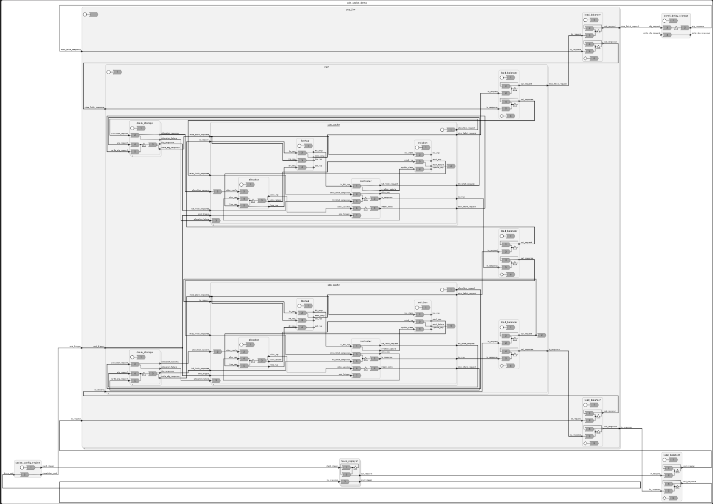

- Feature Name: `localized-layout-options`
- Start Date: 2024-02-09
- RFC PR: [lf-lang/rfcs#0004](https://github.com/lf-lang/rfcs/pull/4)
- Tracking Issue (s): [lf-lang/lingua-franca#0000](https://github.com/lf-lang/lingua-franca/issues/0000)

# Abstract
[abstract]: #abstract

Layout options present on diagram panel have specific use-cases, and there is no single option which can be used for
better visualization of any given LF Code.
Even with one code specific parts of visualization are more comprehensible than the rest with specific layout options
which makes it an extremely hard problem to solve

# Motivation
[motivation]: #motivation

We want to have a localized layout option where a specific part of the diagram can use a different layout approach and
another specific part of the diagram uses another layout approach
The user can select part of diagrams to have say `Optimize Crossings` and the rest of them with say `Full Control`

One way to store this information about the views can be with `metadata`, which might not be the current LF approach
but will be simplistic without cluttering the user-code with un-necessary information about the layout

# Guide-level explanation
[guide-level-explanation]: #guide-level-explanation

Localization of layout approaches in sub-regions of the diagram will help user comprehend, understand and present the
diagrams. 
Diagrams are one of the most powerful features of Lingua-Franca but as soon as the Model becomes sufficiently large
diagrams become hard to comprehend.
Consider the following Model:

Complete source can be found [here](https://github.com/MagnitionIO/LF_Collaboration/blob/main/complex-view-model/src/cdn_cache_demo.lf)

# Reference-level explanation
[reference-level-explanation]: #reference-level-explanation

This can be added in the synthesis options

# Drawbacks
[drawbacks]: #drawbacks

Additional `metadata` would be required which would make the diagram an extension of textual representation instead of 
it being an equivalence of textual representation

# Rationale and alternatives
[rationale-and-alternatives]: #rationale-and-alternatives

- This would enhance the user control over visualization and can help user with the flexibility to make adjustments to the visualization
- A few more options for layouts which user can try and find out which one is more suited for his use-case

# Prior art
[prior-art]: #prior-art

# Unresolved questions
[unresolved-questions]: #unresolved-questions

- Is adding `metadata` the right approach?
- Would lingua franca benefit from annotation generation based on changes to the view?

# Future possibilities
[future-possibilities]: #future-possibilities

This feature would optimise user experience when dealing with large models

