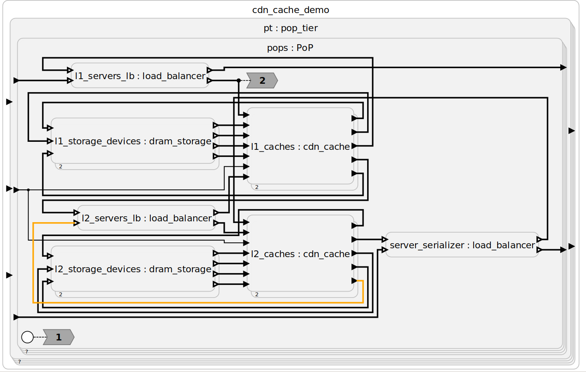

- Feature Name: `colored-input-output`
- Start Date: 2024-02-07
- RFC PR: [lf-lang/rfcs#0003](https://github.com/lf-lang/rfcs/pull/3)
- Tracking Issue(s): [lf-lang/lingua-franca#0000](https://github.com/lf-lang/lingua-franca/issues/0000)

# Abstract
[abstract]: #abstract

Magnition mentioned that input and output ports are hard to differentiate if they are placed on the same reactor side.

Additionally, edges become hard to follow in large diagrams.
This is currently not solved by the edge highlighting mechanism since it highlights the edges by making them thick, which is very hard to spot since a bus is already drawn with a thick line.

# Motivation
[motivation]: #motivation

We want to add color to make it easier to work with large LF models.
If elements are very small, color might help us to differentiate them.
This is even more important if we trade layout stability for edge crossings.

Moreover, I want to test this process with a smaller RFC and see if it fits.
In my opinion the topic above is something to be discussed and I intentionally put two different things in here, since I do not want to do an RFC for them both and they both affect the color scheme.

# Guide-level explanation
[guide-level-explanation]: #guide-level-explanation

The different colors for ports and a proper highlighting for edges improve the readability for browsing big hierarchical models.

When browsing large hierarchical models, which are simplified to have same-side input/output ports, adding different port colors additionally improves the readability.

If one wants to follow an edge, you click on it and is highlighted in a bright color.
This also occurs them clicking the port of an edge.

# Reference-level explanation
[reference-level-explanation]: #reference-level-explanation

This could be added as a hook in the synthesis to add the necessary options and color the elements as required.

# Drawbacks
[drawbacks]: #drawbacks

Too much color might be distracting and additional synthesis options might clutter the sidebar.
However, edge highlighting would only occur when one clicks on an edge.
More synthesis options might not be that distracting once klighd-vscode adds favorites to the sidebar.

# Rationale and alternatives
[rationale-and-alternatives]: #rationale-and-alternatives

- We could also experiment different port shapes to differentiate the ports.
- One could also use a different line style to highlight edges. I am however unsure whether this is enough if drawn line is very thin (since the diagram itself is big).

# Prior art
[prior-art]: #prior-art

- SCCharts uses a light blue to highlight clicked edges
- The large LF models that Magnition is working with pose real, practical UX challenges.

# Unresolved questions
[unresolved-questions]: #unresolved-questions

- I would suggest either a blue or orange for highlighting
- Colors for ports are still up for discussion, maybe black for input and black border with white fill for outputs?

# Future possibilities
[future-possibilities]: #future-possibilities

This would be the first step to optimize LF for large models that might be used in industry.

I needed roughly 30min for this RFC, just as a reference.